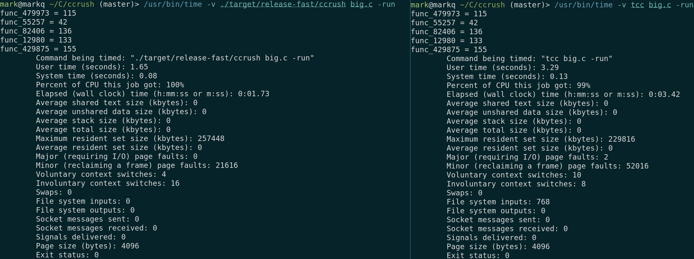

# ccrush

The fastest C compiler in the world.

ccrush is a single-pass, ahead-of-time C compiler written in Rust, built completely from scratch with no LLVM, no libclang. It compiles C directly to x86-64 ELF object files - or runs your code immediately in a JIT mode that mmaps the generated code and executes it in-process.

It is fast because it is designed with handmade spirit: data-oriented, cache-friendly, no unnecessary abstraction. Every little hot structure is sized to fit in cache lines. There is no AST, no IR, no optimization pipeline. The compiler is just a loop over tokens that emits machine code as it goes. Like compilers used to be built back in the day.

---

## Benchmark

> Synthetic input: 5 million lines of auto-generated C functions. Measures raw compiler throughput.

5 million lines of C, JIT mode. ccrush is ~2x faster than TCC with almost identical RSS. This is early work and there is a TON of performance left on the table.



---

## How to build and run

**Requirements:** Rust (stable), Linux x86-64.

```bash
git clone https://github.com/rakivo/ccrush
cd ccrush
cargo build --profile=release-fast
```

**Compile a C file to an object:**
```bash
./target/release-fast/ccrush program.c
clang out.o -o program && ./program
```

**JIT mode - compile and run immediately, no linker needed:**
```bash
./target/release-fast/ccrush program.c -run
```
